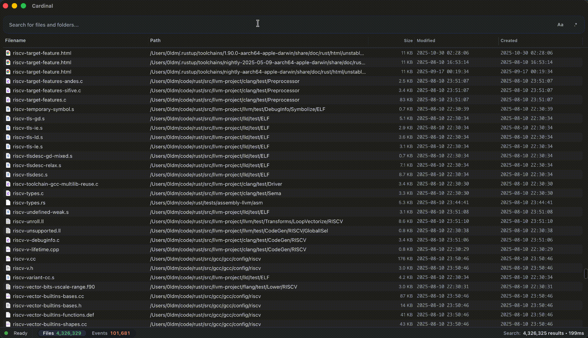

<div align="center">
  
  <h1>Cardinal</h1>
  <p>最快的 macOS 檔案搜尋工具。</p>
  <p>
    <a href="#使用-cardinal">使用 Cardinal</a> ·
    <a href="#建置-cardinal">建置 Cardinal</a>
  </p>
  
</div>

---

[English](README.md) · [Español](README.es-ES.md) · [한국어](README.ko-KR.md) · [Русский](README.ru-RU.md) · [简体中文](README.zh-CN.md) · [繁體中文](README.zh-TW.md) · [Português](README.pt-BR.md) · [Italiano](README.it-IT.md) · [日本語](README.ja-JP.md) · [Français](README.fr-FR.md) · [Deutsch](README.de-DE.md) · [Українська](README.uk-UA.md) · [العربية](README.ar-SA.md) · [हिन्दी](README.hi-IN.md) · [Türkçe](README.tr-TR.md)

## 使用 Cardinal

### 下載

透過 Homebrew 安裝：

```bash
brew install --cask cardinal-search
```

你也可以從 [GitHub Releases](https://github.com/cardisoft/cardinal/releases/) 取得最新的安裝包。

### 國際化支援

想切換其他語言？點擊狀態列裡的 ⚙️ 按鈕即可即時切換。

### 基礎搜尋語法

Cardinal 現在在經典的子字串/前綴匹配基礎上疊加了 Everything 相容語法：

- `report draft` – 空白代表 `AND`，只會得到同時包含兩個詞的檔案。
- `*.pdf briefing` – 只顯示檔名包含「briefing」的 PDF 結果。
- `*.zip size:>100MB` – 查找大於 100MB 的 ZIP 檔案。
- `infolder:/Users demo !.psd` – 把搜尋範圍限制在 `/Users`，然後匹配包含 `demo` 但排除 `.psd` 的檔案。
- `tag:ProjectA;ProjectB` – 按 Finder 標籤（macOS）過濾；`;` 表示 `OR`（滿足任一標籤即可）。
- `*.md content:"Bearer "` – 僅篩選包含字串 `Bearer ` 的 Markdown 檔案。
- `"Application Support"` – 使用引號匹配完整片語。
- `brary/Applicat` – 使用 `/` 作為路徑分隔符向下匹配子路徑，例如 `Library/Application Support`。
- `/report` · `draft/` · `/report/` – 在詞首/詞尾添加 `/`，分別強制匹配前綴、後綴或精確檔名，補足 Everything 語法之外的整詞控制。
- `~/**/.DS_Store` – `**` 會深入所有子目錄，在整個家目錄中查找散落的 `.DS_Store` 檔案。

更多支援的運算子（布林組合、資料夾限定、擴充名過濾、正則示例等）請參見 [`doc/search-syntax.md`](doc/search-syntax.md)。

### 鍵盤快捷鍵與預覽

- `Space` – 不離開 Cardinal 即可對目前行執行 Quick Look。
- `Cmd+R` – 在 Finder 中定位選中的結果。
- `Cmd+F` – 焦點回到搜尋框。
- `Cmd+C` – 複製所選檔案的路徑。
- `Cmd+Shift+Space` – 透過全域快捷鍵開/關 Cardinal 視窗。

祝你搜尋愉快！

---

## 建置 Cardinal

### 環境需求

- macOS 12+
- Rust 工具鏈
- Node.js 18+（附 npm）
- Xcode 命令列工具和 Tauri 依賴（<https://tauri.app/start/prerequisites/>）

### 開發模式

```bash
cd cardinal
npm run tauri dev -- --release --features dev
```

### 生產建置

```bash
cd cardinal
npm run tauri build
```
